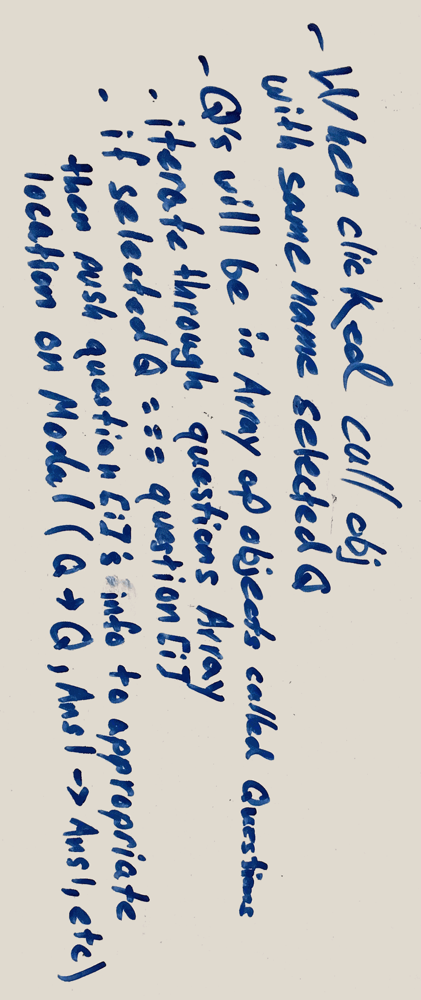

# Jeopardy! Project

## Game Overview/Rules

In Jeorpardy! there are 6 themed categories with 30 "answers" total. A player selects "answers" of their choice from a category/monetary value and is given multiple "questions" to choose from. The categories are usually hints to the correct response. If the player chooses the correct "question" then player will bank the money value of the chosen "answer" to their score and if they choose incorrectly they will have that money value deducted from their score. This continues until there are no more "answers" available on the board at which point the player will prompted by the final Jeopardy "answer", worth a substantial amount of money, after which the game will be over. The player will win if they have more than zero dollars banked after final Jeopardy.

## Deployed Site
[Game site](https://pshivers.github.io/Project1/)

## Project Board
[Trello](https://trello.com/b/O6qorD64/jeopardy)

## Whiteboarding

## Wire Frames

